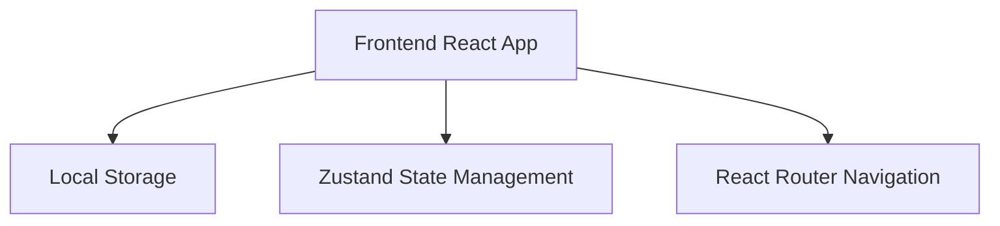
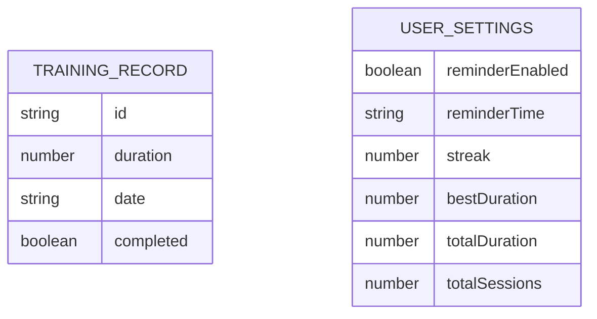

## 1. Architecture Design


## 2. Technology Description
- Frontend: React@18 + TypeScript + tailwindcss@3 + vite
- Initialization Tool: vite-init
- Backend: None（纯前端应用）
- Database: Local Storage（浏览器本地存储）
- State Management: Zustand
- Routing: React Router DOM

## 3. Route Definitions
| Route | Purpose |
|-------|---------|
| / | 训练首页 |
| /training | 训练进行页 |
| /complete | 训练完成页 |
| /stats | 统计数据主页 |
| /settings | 设置页 |

## 4. API Definitions
不适用后端API

## 5. Server Architecture Diagram
不适用后端服务

## 6. Data Model
### 6.1 Data Model Definition


### 6.2 Data Storage
使用浏览器 Local Storage 存储数据，无需数据库服务。

存储数据结构：
```typescript
interface TrainingRecord {
  id: string;
  duration: number; // 秒
  date: string; // ISO date string
  completed: boolean;
}

interface UserSettings {
  reminderEnabled: boolean;
  reminderTime: string; // HH:mm
  streak: number;
  bestDuration: number;
  totalDuration: number;
  totalSessions: number;
}
```
