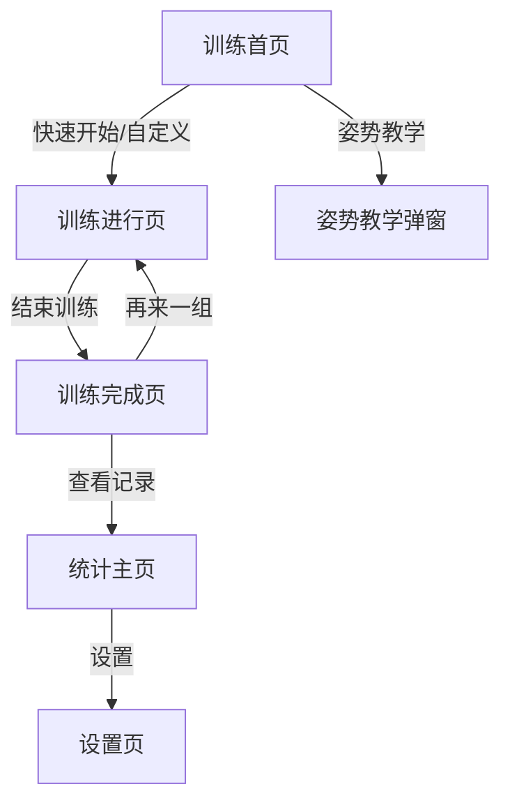

## 1. Product Overview
极简平板支撑训练APP，帮助用户进行平板支撑训练，提供计时、统计和提醒功能。
- 核心功能：训练计时、自定义训练、数据统计、打卡提醒
- 目标用户：需要进行平板支撑锻炼的健身爱好者

## 2. Core Features

### 2.1 User Roles
| Role | Registration Method | Core Permissions |
|------|---------------------|------------------|
| Normal User | 无需注册 | 使用所有功能，本地存储数据 |

### 2.2 Feature Module
1. **训练页（Tab1）**：训练首页、训练进行页、训练完成页
2. **统计页（Tab2）**：统计数据主页、设置页

### 2.3 Page Details
| Page Name | Module Name | Feature description |
|-----------|-------------|---------------------|
| 训练首页 | 连续训练天数 | 左上角展示连续训练天数 |
| 训练首页 | 动作教学 | 右上角点击弹出浮层，展示标准姿势和常见错误 |
| 训练首页 | 快速开始训练 | 超大按钮，点击直接进入计时训练页 |
| 训练首页 | 自定义训练 | 支持设置训练时长、组数、组间休息 |
| 训练首页 | 当日训练状态 | 显示完成/未完成标识 |
| 训练进行页 | 倒计时 | 超大居中倒计时数字和圆形进度环 |
| 训练进行页 | 操作按钮 | 暂停、结束训练 |
| 训练完成页 | 训练结果 | 展示训练时长、目标达成、连续天数更新 |
| 统计主页 | 连胜标识 | 展示连续打卡状态 |
| 统计主页 | 打卡热力图 | 日历式绿点展示每日训练记录 |
| 统计主页 | 数据卡片 | 总时长、总次数、个人最佳 |
| 统计主页 | 历史记录 | 完整训练历史列表 |
| 设置页 | 打卡提醒 | 每日提醒开关、自定义提醒时间 |

## 3. Core Process
用户打开APP → 选择Tab1训练或Tab2统计 → 训练页：快速开始或自定义训练 → 进行训练 → 训练完成 → 查看数据或再次训练

## 4. User Interface Design
### 4.1 Design Style
- 极简干净、无广告、无冗余装饰
- 配色：白色/浅灰背景，蓝色/绿色主色调
- 按钮：圆角矩形，简洁大方
- 字体：无衬线字体，清晰易读
- 布局：卡片式，双底部Tab固定导航
- 图标：简约线性图标

### 4.2 Page Design Overview
| Page Name | Module Name | UI Elements |
|-----------|-------------|-------------|
| 训练首页 | 顶部信息区 | 左上角连续天数，右上角教学按钮 |
| 训练首页 | 核心按钮区 | 超大快速开始按钮，自定义训练入口 |
| 训练进行页 | 计时区 | 超大数字倒计时，圆形进度环 |
| 统计主页 | 热力图 | 日历式布局，绿点标记训练日 |
| 所有页面 | 底部导航 | 双Tab固定导航 |

### 4.3 Responsiveness
移动优先设计，适配移动端屏幕尺寸，触摸优化交互体验

### 4.4 3D Scene Guidance
不适用3D场景
